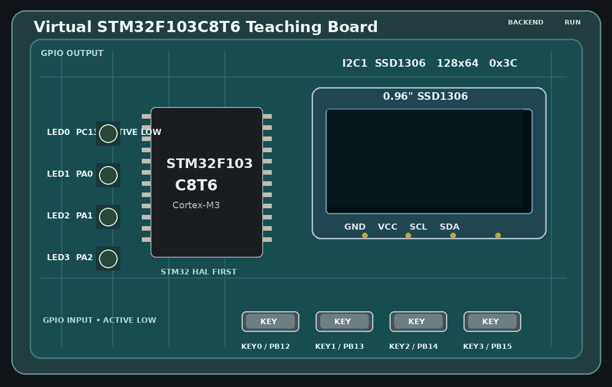

# VirtualSTM32F103C8T6 V0.1.1 (Windows MVP)



一个受 NVBoard 思路启发的 **STM32F103C8T6 虚拟教学开发板**。目标不是让用户改写程序去“适配模拟器”，而是让 CubeIDE / Keil5 正常编译 STM32 HAL 工程，生成 ELF/AXF 后自动弹出一块虚拟板，并运行同一份固件。

## V0.1.1 已实现的板级功能

- MCU：STM32F103 系列 Cortex-M3，后端使用 Renode `stm32f103.repl`
- GPIO 输出：4 个固定 LED
  - LED0 = PC13，低电平点亮（符合常见 F103 板习惯）
  - LED1 = PA0，高电平点亮
  - LED2 = PA1，高电平点亮
  - LED3 = PA2，高电平点亮
- GPIO 输入：4 个按键，全部低电平按下
  - KEY0 = PB12
  - KEY1 = PB13
  - KEY2 = PB14
  - KEY3 = PB15
- OLED：SSD1306 128x64、I2C1、7-bit 地址 0x3C
  - 使用 Renode `DummyI2CSlave` 接收 HAL I2C1 外设写事务
  - IronPython 解析常见 SSD1306 命令/显存写入
  - GUI 动态显示 128x64 framebuffer
- Windows GUI：SDL2 + BMP 贴图
- 运行控制：Space 暂停/继续，R 复位，Esc 退出
- 预留调试：Renode GDB Server 默认尝试开放 `localhost:3333`

> V0.1.1 的重点是把“HAL 固件 -> Renode -> GPIO/I2C -> 虚拟贴图板”完整跑通。它不是 STM32F103 的 100% 周期精确硬件替代品。

## 目录

```text
VirtualSTM32F103C8T6/
├─ src/
│  ├─ app/               应用生命周期（不放具体外设逻辑）
│  ├─ backend/           Renode 进程与 Monitor 通信
│  ├─ board/             教学板组合与引脚配置
│  ├─ peripherals/       IPeripheral + LED/按键/SSD1306 模块
│  └─ ui/                SDL2 贴图缓存
├─ assets/               板卡、LED、按键、OLED 模块 BMP 贴图
├─ renode/               SSD1306 I2C -> framebuffer bridge
├─ tools/                构建、环境诊断、IDE 接入脚本
│  └─ patches/           可重复执行的版本修复/迁移脚本
├─ docs/                 架构、IDE 配置、限制说明
└─ examples/             HAL 配置/测试代码片段
```

## V0.1.1 重要修复：NMake / `-A x64`

V0.1.0 的 `build_windows.ps1` 没有显式指定 Visual Studio Generator。如果用户环境变量或 CMake 默认 Generator 是 `NMake Makefiles`，同时脚本传入 `-A x64`，CMake 会报：

```text
NMake Makefiles does not support platform specification x64
```

V0.1.1 已改为自动检测并显式选择 `Visual Studio 18 2026` 或 `Visual Studio 17 2022`，同时会清理使用了错误 Generator 的旧 `build/` 缓存。

老 V0.1.0 工程也可运行：

```powershell
powershell -ExecutionPolicy Bypass -File .\tools\patches\001_fix_cmake_generator.ps1
```

然后重新运行 `tools\build_windows.ps1`。

## 模块化约束

所有新外设优先实现 `src/peripherals/IPeripheral.h`。`App` 只负责窗口、Renode 生命周期以及事件分发，不再直接保存 LED/按键/OLED 状态。新增蜂鸣器、UART、SPI 屏等时，原则上新增外设类并在 `TeachingBoard` 注册，不把逻辑继续堆回 `App.cpp`。详见 `docs/ARCHITECTURE.md` 与 `docs/DEVELOPMENT.md`。

## 1. 准备环境

需要：

1. Windows 10/11 x64
2. Visual Studio / Build Tools 的 **Desktop development with C++**（脚本优先支持 VS 2026，其次 VS 2022）
3. CMake；若只安装 Visual Studio 2026，需要 CMake 4.2+ 才识别 `Visual Studio 18 2026` 生成器
4. 网络（第一次 CMake 配置会下载 SDL2 2.32.10）
5. Renode 1.16.1 Windows portable（`setup_renode.ps1` 自动下载并校验 SHA256）

先检查环境：

```powershell
powershell -ExecutionPolicy Bypass -File .\tools\doctor.ps1
```

首次安装推荐一条命令完成 Renode + 编译：

```powershell
powershell -ExecutionPolicy Bypass -File .\tools\setup_all.ps1
```

也可以只下载 Renode：

```powershell
powershell -ExecutionPolicy Bypass -File .\tools\setup_renode.ps1
```

脚本会放到：

```text
third_party\renode\renode.exe
```

## 2. 构建

```powershell
powershell -ExecutionPolicy Bypass -File .\tools\build_windows.ps1
```

完成后：

```text
build\Release\VirtualSTM32.exe
```

资源和 SDL2.dll 会由 CMake 自动复制到 EXE 旁边。

## 3. 手动运行一个 STM32 ELF

```powershell
.\build\Release\VirtualSTM32.exe --elf "D:\STM32\MyProject\Debug\MyProject.elf"
```

也接受 Keil 常见 `.axf`：

```powershell
.\build\Release\VirtualSTM32.exe "D:\Keil\Project\Objects\project.axf"
```

## 4. CubeIDE：编译完成自动弹出虚拟板

推荐使用 `makefile.targets`，因为 CubeIDE 会提供 `BUILD_ARTIFACT` 等构建产物宏。

1. 将 `tools/cubeide_makefile.targets.example` 复制到你的 STM32 工程根目录
2. 改名为 `makefile.targets`
3. 修改其中 `VSTM32_ROOT`
4. 正常 Build/Run

成功链接 ELF 后会执行 `tools/ide_launch.cmd`：旧虚拟板被关闭，新固件像“重新烧录实体开发板”一样立即启动。

如果你只想在某个配置中启用，也可在 Project Properties -> C/C++ Build -> Settings -> Build Steps 中调用 `ide_launch.cmd`。

## 5. Keil5：Build/Rebuild 完成自动弹出

进入：

`Options for Target -> User -> After Build/Rebuild`

添加：

```text
"C:\Tools\VirtualSTM32F103C8T6\tools\ide_launch.cmd" "#L"
```

具体见 `tools/keil_after_build_example.txt`。

## 6. CubeMX/HAL 建议配置

### GPIO

- PC13：GPIO_Output
- PA0/PA1/PA2：GPIO_Output
- PB12/PB13/PB14/PB15：GPIO_Input + Pull-up（或外部上拉语义）

### I2C1

- PB6 = I2C1_SCL
- PB7 = I2C1_SDA
- 常规 100kHz/400kHz 均可，仿真不依赖真实上升沿模拟

SSD1306 地址：

```c
#define SSD1306_I2C_ADDR (0x3C << 1)   // HAL API 常用 8-bit address 参数 = 0x78
```

OLED bridge 已支持常见初始化/寻址命令以及 1024-byte framebuffer 更新。最稳妥的 V0.1 写法是硬件 I2C，不要先用 GPIO bit-bang 软件 I2C。

## 7. 键盘/鼠标

- 鼠标按住 KEY：对应 PB12~PB15 = 0
- 鼠标松开 KEY：对应 GPIO = 1
- `Space`：Pause / Run
- `R`：Reset
- `Esc`：Exit

## 8. 调试预留

程序启动后会 best-effort 执行：

```text
machine StartGdbServer 3333
```

因此后续可以把 CubeIDE/arm-none-eabi-gdb 接到：

```text
localhost:3333
```

V0.1 GUI 尚未实现断点/单步窗口，但后端接口和生命周期已经预留。

## 9. 已知限制

见 `docs/LIMITATIONS.md` 和 `docs/VALIDATION.md`。最重要的两点：

1. Renode 当前 STM32F103 通用 platform 并不严格按 C8T6 的 64KB Flash / 20KB SRAM 做容量越界约束；V0.1 首先追求 HAL 兼容链路。
2. 某些非常依赖 RCC/Flash latency/精确外设时序的 HAL 工程可能需要补 Renode platform model；GPIO + SysTick/HAL_Delay + I2C1 是本 MVP 的优先验证范围。

## License

本项目代码可按 MIT 使用。`Renode` 自身为 MIT；`SDL2` 使用 zlib license。它们由各自上游项目维护，本仓库不包含 Renode 二进制。
